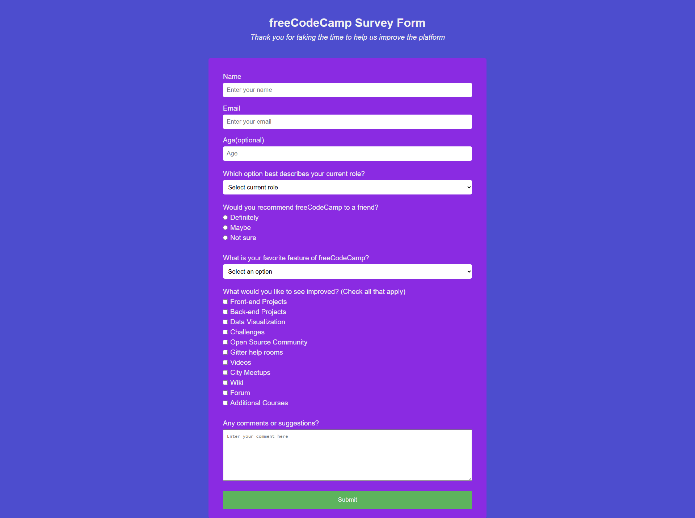

# Survey Form

## 📖 Description ##

This is a survey form created as part of the freeCodeCamp Responsive Web Design certification. It collects user input through various form elements.

## 🎯 Objectives ##

- Use semantic HTML5 elements
- Apply basic CSS styling

## 🛠️ Technologies Used ##

- HTML5
- CSS3

## 🚀 Getting Started ##

To run this project locally:

1. Clone the repository:
   git clone https://github.com/AnouGeek/survey-form.git
2. Open the folder and launch the index.html file in your browser.

## 📸 Screenshot ##

## 🪪 License ##

This project is licensed under the MIT License.